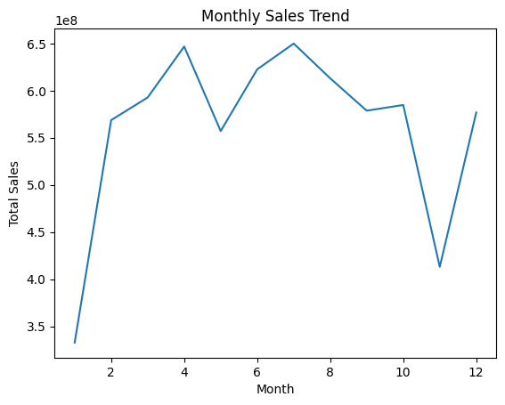
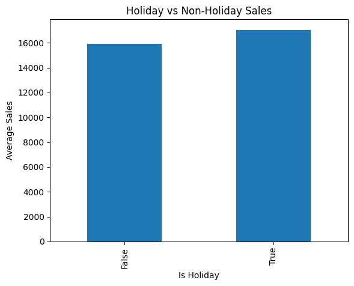

# Supply Chain Demand Forecasting & Inventory Analysis

## Project Overview
Built a machine learning model to forecast retail demand and analyze supply chain patterns using Walmart sales data.

---

## Objectives
- Analyze seasonal demand trends
- Study holiday impact on sales
- Build a demand forecasting model
- Improve inventory planning insights

---

## Dataset
- Walmart Retail Dataset (~421K rows)
- Features: Store, Dept, Date, Weekly Sales, Holiday

---

## Tech Stack
- Python (Pandas, Scikit-learn)
- Matplotlib
- Jupyter Notebook

---

## Key Insights
- Sales peak mid-year (seasonality present)
- Holiday periods show higher demand
- Demand patterns vary across stores/departments

---
## Visualizations

### Monthly Sales Trend

### Holiday vs Non-Holiday Sales

---

## Model
- Random Forest Regressor
- Feature Engineering: Month, Year, Lag feature

---

## Results
- MAE: ~1715
- R² Score: ~0.97

---

## Business Impact
- Helps predict demand accurately
- Reduces stockouts during peak periods
- Supports inventory optimization

---

## Files
- `analysis.ipynb` → full code
- `model.pkl` → trained model

---

## Author
Helen Maria Ajay
